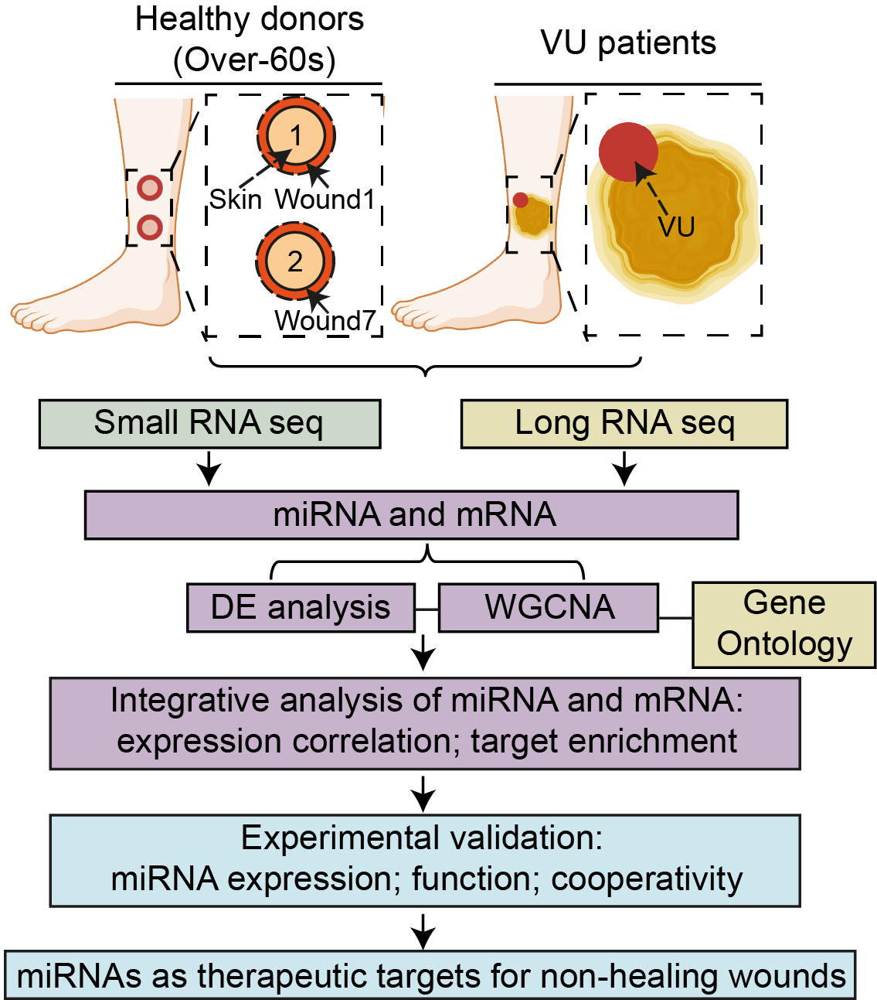

 

# Integrative small and long RNA omics analysis of human healing and nonhealing wounds discovers cooperating microRNAs as therapeutic targets

 

    **If you use it in published research, please cite:** Zhuang Liu\*, Letian Zhang\*, Maria-Alexandra Toma, Dongqing Li, Xiaowei Bian, Irena Pastar, Marjana Tomic-Canic, Pehr Sommar, Ning Xu Landén. Integrative small and long RNA omics analysis of human healing and nonhealing wounds discovers cooperating microRNAs as therapeutic targets. eLife 11:e80322 (\*Co-first author)

_________________

> In this tutorial, we will give you a brief introduction of playing around with the **miRNA-mRNA profiling visualization tool** for normal acute wounds and venous ulcers in human skin.

  

 

#### There are five sections as below:
- <strong>miRNA-mRNA expression</strong>
- <strong>DE miRNA analysis</strong>
- <strong>miRNA WGCNA</strong>
- <strong>DE mRNA analysis</strong>
- <strong>mRNA WGCNA</strong>

> - <strong>miRNA-mRNA expression: </strong> 
You can check the **expressions of miRNA and mRNA** by searching the microRNA name (**Left**: e.g. <ins>hsa-miR-34a-5p</ins>) and mRNA gene symbol name (**Right**: e.g. <ins>LGR4</ins>), respectively. Saving these plots as **.PDF** files.

> - <strong>DE miRNA analysis</strong> & <strong>DE mRNA analysis: </strong>
Here, checking the lists of miRNAs and mRNAs in the differential expression (DE) analysis across different conditions (e.g. <ins>VU vs. Skin</ins>, <ins>VU vs. Wound1</ins>, <ins>VU vs. Wound7</ins>) by using different criteria (e.g. <ins>log2(fold change)</ins>, <ins>p adjust value</ins>). Saving the **heatmap** and **dataset** if you like it.

> - <strong>miRNA WGCNA</strong> & <strong>mRNA WGCNA: </strong>
In addition, checking the gene lists of **miRNA and mRNA modules** in the weighted gene co-expression network analysis (WGCNA) in different conditions. Visualizing the expression of top 20 kME (module membership: the higher means the more contribution) genes in each module. Saving the **heatmap** and **dataset** if you like it.

 

#### VIDEO DEMO
<video width="100%" height="100%" controls align="center">
  <source src="miRNA.mp4" type="video/mp4">
</video>
